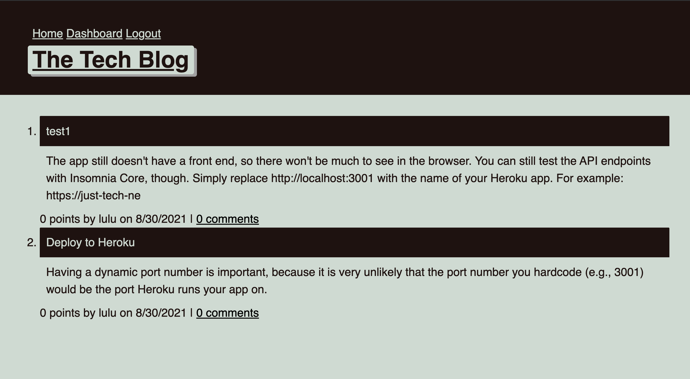

# tech-blog

## User Story
  
```
AS A developer who writes about tech
I WANT a CMS-style blog site
SO THAT I can publish articles, blog posts, and my thoughts and opinions

```

## Description
  This application allow users can publish their blog posts and comment on other users' posts as well. This application follows the MVC paradigm in its architectural structure, using Handlebars as the html files, Sequelize as the ORM, and the express-session npm package for authentication.
## Heroku 
[tech blog App](https://dry-caverns-77370.herokuapp.com/)
## Screenshot

## Table of Contents
- [Description](#description)
- [Heroku Link](#Heroku)
- [Installation](#installation)
- [Usage](#usage)
- [Languages](#languages)
- [Contributing](#contributing)
- [Reference](#reference)
- [Questions](#questions)
## Installation
  `npm init -y`
  
  `npm i bcrypt connect-session-sequelize dotenv express express-handlebars express-session handlebars mysql2 sequelize`
## Usage
  Run the following command at th root of your project and answer the prompted questions:<br />

  `npm start`

  
## Languages
  JavaScript,Node,Handlebars,CSS,Express, Mysql
## Contributing
  ChunYu Chang
## Reference
  1.Class Moudles <br />
  https://github.com/mr91217/just-tech-news<br />
## Questions
 Contact me<br />

## Contact
GitHub: [mr91217](https://github.com/mr91217)<br />
<br />
Email: mr91217@gmail.com<br />
<br />